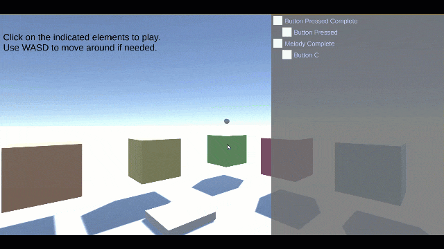

# Unity Tutorial-System Engine

This module contains the necessary code to build an event based tutorial 
system for Unity games. 

In modern games we player expect to be gently taught how to play the game. 
For this purpose the first level or two contains a carefully choreographed 
walk-through where each step is laid out clearly. The game tracks our 
progress and guides us towards the next step. 

The code in this module contains all necessary ingredients to build such 
a system. It contains an central event bus with predefined, strongly 
referenced events, state tracking and user interface components to visualise 
the current state of the tutorial.

Larger sequences of events can be broken down into smaller tasks. You can 
flexibly combine multiple task-flows into larger work-flows, including 
optional or alternative tasks.

## Usage and Setup

### Step 1: Define the events the system tracks.

The system tracks events that happen in your game. I would recommend to 
model these events as a workflow or sequence diagram, it will make your 
task a lot easier.

After planing out which events you need in your game, create one ore more 
EventStream scriptable objects (via the menu 
``Assets->Create ..->Event Stream->Event Stream``).

Each EventStream declears the messages it can handle. Messages are in 
itself scriptable objects and can contain additional properties.

To create messages, open the event stream object in the Unity inspector 
and add entries to the "Message Types" list. When you defined all entries, 
save the object, then press "Generate Message Handles", and then save 
once again. 

(Scriptable objects that have been generated as child objects do not show 
up in the inspector and project browser until the currently pending
changes have been saved. This is a peculiar Unity-Editor behaviour that
we cannot change.)

***Warning***: If you rename or reorder events, Unity will generate new 
object-IDs for each message. This usually erases all references to these 
objects in MonoBehaviours. After making changs to the event-stream, you 
will have to revalidate your objects.

### Step 2: Generating event-stream messages

Program your game logic as usual. Whenever something happens in your game 
that should trigger a state change in the tutorial (ie. the player completed 
a task) you need to fire an event for the event-stream.

Each mesasge object carries a reference to its event stream. If you have a 
reference to a message, you can simply fire the event by invoking 
``BasicEventStreamMessage#Publish()``.

The UnityTutorialSystem ships with a ``PublishStreamEvent`` MonoBehaviour that
you can add to your existing game objects. This MonoBehaviour holds a 
reference to a EventStreamMessage object and contains a single public 
method (``TriggerEvent()``) to publish the event to the event stream. You can
either call this method from your code (or hold a reference to the 
EventStreamMessage and call ``Publish()`` yourself), or you can wire up this 
method to an UnityEvent that your game object componentns expose.

The cubes in the demo scene contain a MouseEventPublisher script that raises 
an UnityEvent for each mouse event that is triggered on MonoBehaviour scripts. 
In the demo, the ``clicked`` event then calls the 
``PublishStreamEvent#TriggerEvent`` method on the PublishStreamEvent that is 
also added to each cube.

### Step 3: Processing event stream messages

Each event stream forwards all valid received events to all listeners for 
processing. The processing to combine multiple events to track larger state 
changes happens in event aggregator MonoBehaviours.

The default implementations shipped in the library are configured with a list 
of EventStreamMessage objects. The aggregators automatically subscribe to all 
required event message streams and expose UnityEvents for when the aggregator 
becomes active, progressed to the next state, and when matching succeeded or 
failed. All aggregators track all relevant event states internally and 
publish the current state of its tracking via the ListEvents method. The 
EventMessageState informs you of each message the stream expects and whether 
the message has been received, or whether this message is the next expected 
event.

For event processing the UnityTutorialSystem provides the following implementations:

* EventSequenceAggregator

  Represents an ordered sequence of events. The event aggregator will report 
  a successful match if all defined events have been recorded in the defined 
  order.
  
  This aggregator can process events out of order if the next event message 
  is marked as out-of-order executable, and if the event aggregator's 
  validation mode is set to ``AllowOutOfOrderEvents``.
  
  > In the demo scene, the MelodyStateHandler is a sequence aggregator
  > that tracks clicks on the coloured cubes. Each click generates
  > a tone and successfully playing the melody will complete the task.
  
* EventSetAggregator

  Represents an unordered sequence of events.
  
  The aggregator will report a successful match if all defined events have 
  seen seen at least once.
  
  If matching is set to strict, the aggregator will fail the matching if 
  any duplicate event has been received.
  
* OneOfEventSetAggregator

  Represents a choice of events. This aggregator will report an success as 
  soon as one of the defined events has been received.

* EventMessageCounter

  An simple example aggregator that counts incoming events that match
  the given event message.

### Step 4: Combine Event Aggregators

Each event aggregator publishes UnityEvents during state changes. This
means you can add a PublishStreamEvent component to publish messages on
these events. 

As it is very common to send events when a event aggregation
is complete, this project also contains the specialised 
``TutorialEventStatePublisher`` MonoBehaviour to simplify the configuration
of the event processing. 

### Step 5: Displaying Task Lists

Tutorials usually display a list of tasks to guide the player through
these crucial first steps. This project ships with a simple Tree/List
GUI component that displays the known events inside a Unity GUI. 

The tree/list display consists of two parts:

* The TutorialEventStreamManager is responsible for building a 
  display model of all known event aggregators and their relationships
  between each other. This class constantly monitors and updates all
  aggregators to update the display model with the new data.
  
  The resulting model is then published to a TutorialEventTreeView.

* The TutorialEventTreeView is a Unity-GUI controller that is responsible
  for displaying the model content in the UI.

  In the demo a Unity-canvas contains a ScrollPane and a dynamic, 
  vertical list of elements. The ``ContentList`` game object contains 
  the TreeView script that is responsible for instantiating new display 
  elements for each element in the tree model.
  
  The ``_Template`` game object is used as template for each data item.

If an EventAggregator uses a TutorialEventStatePublisher
to publishes a success message, and if that message is expected in another 
EventAggregator, the TutorialEventStreamManager treats this as a 
hierarchical relationship between the two aggregators.

> In the sample scene, the 'CombinedStateHandler' aggregator game object
> receives events from both the MelodyStateHandler and the ButtonStateHandler
> object. The TutorialEventStreamManager on the StateHandlers game object
> therefore treats both both the MelodyStateHandler and the ButtonStateHandler
> as dependents (ie child tasks) of the CombinedStateHandler.

### Step 6: Indicating the next possible step

No player wants to be left guessing the next valid step in a tutorial.
Therefore games commonly show indicators over the game objects where the 
player can solve the next task. 

In the UnityTutorialSystem project, the ``NextEventSelector`` monobehaviour
implements a simple tracking script that watches event aggregators for
changes. If the defined 'next message' becomes one of the expected
next steps in the monitored aggregators this script fires an 
``enableForNextMessage`` event, and a ``disableForNextMessage`` event
when the define event stream message is no longer an expected next step.

In the demo scene we use this to enable and disable small bouncing ball
indicators over the next cube the player should click.

